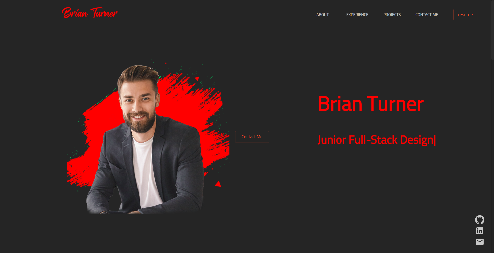

# React Portfolio 

## Brief Description 🔖 
   My professional React Portfolio

## Table of Contents 📇
   * [Brief Description](#description)
   * [About React Portfolio](#about)
   * [Installation](#install)
   * [Usage](#usage)
   * [Testing](#test)
   * [Screenshots](#screenshots)
   * [Demo Video](#demo)
   * [Github Pages URL](#pages) 
   * [Github Repository URL](#repo)
   * [Heroku Deployment URL](#heroku)
   * [Contact Details](#contact)
   * [License](#license)
   * [Contributions to Repo](#contributions)
   * [Additional Information](#info)

## About React Portfolio 📖 
   The purpose of this project is to build a basic site consisting of my professional react portfolio which within the content consist of what we have learned thus far in SMU's coding bootcamp. This can showcase my development skills and work completed for future and of course SMU's coding bootcamp. Creating this type of site will give potential clients/employers some insight into the developer through several sections within the page such as the "About Me" section. This site is an important tool in obtaining opportunities for employment.
   
## Installation 🏗️ 
   npm i
 
## Usage 📝 
   npm start   
      
## Testing 
   npm test

## Screenshots 📷 
   
    
   
## Demo Video 📺 

        
## Github Pages URL 🔗 
   <a href="https://bkturner1220.github.io/React_Portfolio" target="_blank">https://bkturner1220.github.io/React_Portfolio</a>
   
## Github Repository URL 🔗 
   <a href="https://github.com/bkturner1220/React_Portfolio" target="_blank">https://github.com/bkturner1220/React_Portfolio</a>

## Heroku Deployment URL 🔗 
   <a href="https://git.heroku.com/secret-savannah-22428.git" target="_blank">https://git.heroku.com/secret-savannah-22428.git</a>
     
## Contact Information 
   Github Username: [bkturner1220](https://github.com/bkturner1220/) 
   Github: <a href="https://github.com/bkturner1220/">https://github.com/bkturner1220/</a> 
   Email: <a href="mailto:bturner@texascdlprep.com">bturner@texascdlprep.com</a>
   
## License Information 📛 
 
   The application is covered under MIT license.
   
## Contributions towards React Portfolio 👫 
   SMU Coding Bootcamp
         
## Additional Information 
   If you encounter any problems, please feel free to reach out to me by sending me a [Email] to <a href="mailto:bturner@texascdlprep.com">bturner@texascdlprep.com</a>.
